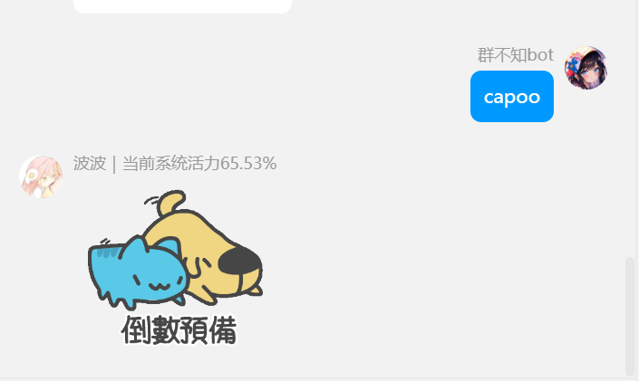
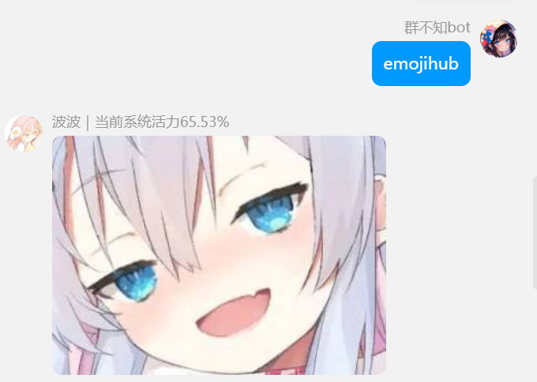
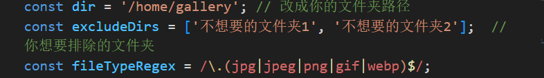
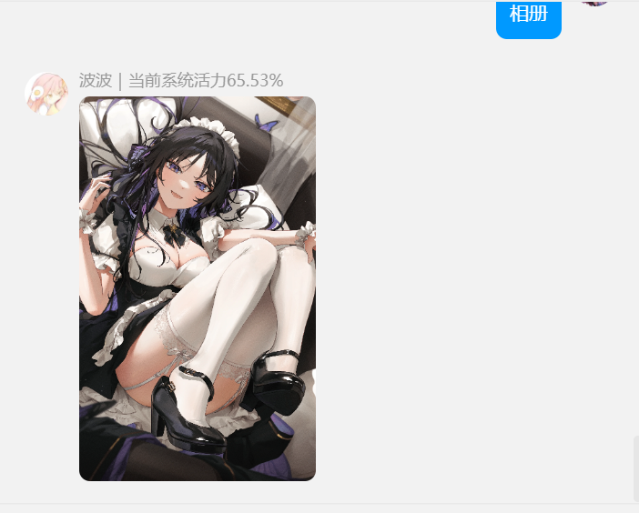
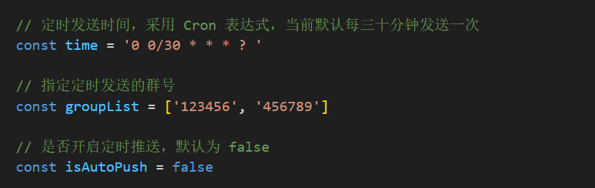
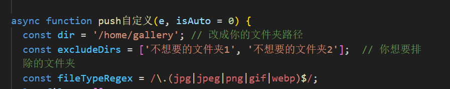
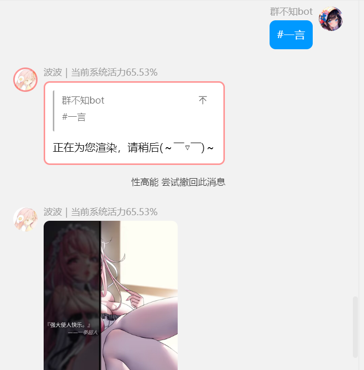
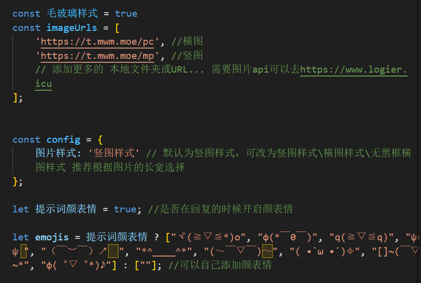

<style>
.card {
  width: 95%;
  height: 220px;
  margin: auto;
  background: url('./screenshot/ina-min.webp') no-repeat center center / cover;
  border-radius: 15px;
  box-shadow: 0px 0px 10px rgba(0,0,0,0.5);
  display: flex;
  flex-direction: column;
  align-items: flex-start;
  padding: 20px;
  text-decoration: none;
}
.card:hover {
  box-shadow: 0px 0px 20px rgba(0,0,0,0.5);
}
.card img {
  width: 180px;
  height: 60px;
  object-fit: contain;
  margin-bottom: 80px;
}
svg {
  width: 43%;
  height: 120px;
}
svg text {
  text-transform: uppercase;
  animation: stroke 5s infinite alternate;
  letter-spacing: 10px;
  font-size: 60px;
}
@keyframes stroke {
  0% {
    fill: rgba(72, 138, 20, 0);
    stroke: rgba(54, 95, 160, 1);
    stroke-dashoffset: 25%;
    stroke-dasharray: 0 50%;
    stroke-width: 0.8;
  }
  50% {
    fill: rgba(72, 138, 20, 0);
    stroke: rgba(54, 95, 160, 1);
    stroke-width: 1.2;
  }
  70% {
    fill: rgba(72, 138, 20, 0);
    stroke: rgba(54, 95, 160, 1);
    stroke-width: 1.5;
  }
  90%,
  100% {
    fill: rgba(72, 138, 204, 1);
    stroke: rgba(54, 95, 160, 0);
    stroke-dashoffset: -25%;
    stroke-dasharray: 50% 0;
    stroke-width: 0;
  }
}
</style>
<a class="card" href="https://www.logier.icu" target="_blank">
  
  <svg viewBox="0 0 800 200">
    <rect x="0" y="60%" width="450" height="80" fill="#f0f0f0" rx="15" ry="15" />
    <text x="30" y="92%"> 获取图片api </text>
  </svg>
</a>

## emojihub

```
curl -o "./plugins/example/emojihub.js" "https://gitee.com/logier/emojihub/raw/main/emojihub.js"
```

1.发送表情包支持capoo、狗妈、黑白、龙图、柴郡、小黑子
发送capoo即可



推荐把仓库的emojihub文件下载并放到resources文件夹内，会检测是否有本地图片，没有会发送网络图片 

2.发送emojihub可以发送从emojihub文件夹 内随机一张图片 

你可以把你的表情包文件夹放到emojihub文件夹下，不屏蔽就会一起随机读
默认屏蔽龙图

如果你们有更多表情包欢迎提供！

3.支持自定义图片

将路径改为你的图库的路径


## 定时发图

```
curl -o "./plugins/example/定时发图.js" "https://gitee.com/logier/emojihub/raw/main/定时发图.js"
```



需要设置这两部分，效果如下


## 图片一言

```
curl -o "./plugins/example/maxim.js" "https://gitee.com/logier/emojihub/raw/main/maxim.js"
```

发送带有图片的一言、人间、毒鸡汤、舔狗日记、社会语录、骚话、发病、烧脑、疯狂星期四

需要的设置如下图

图片支持本地文件夹和网络图片api
如果没有图片可以去https://www.logier.icu找
如果有更多文案欢迎推荐给我


## 今日运势

```
curl -o "./plugins/example/今日运势.js" "https://gitee.com/logier/emojihub/raw/main/今日运势.js"
```

[原项目地址](https://github.com/Twiyin0/koishi-plugin-jryspro)

